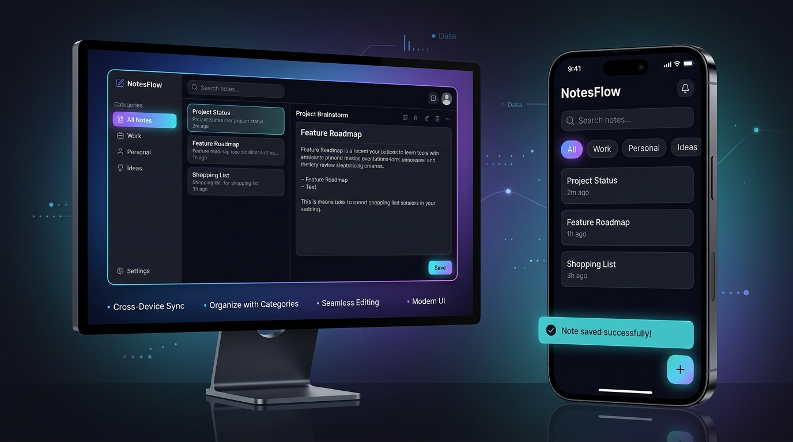

# ✨ Notes App — Modern Full-Stack CRUD Application

A modern, high-performance **Full-Stack Notes Application** built with **React, Node.js, Express, and MongoDB**. Designed with a glassmorphic aesthetic, dark/light theme switching, instant search & categorization, color accents, note pinning, copy-to-clipboard, animated modals, and toast notifications.

---

## 📸 App Previews

<div align="center">

### 🌙 Dark Mode (Glassmorphic Theme)


### ☀️ Light Mode (Modern Clean Theme)


### 📱 Responsive & Cross-Device Experience


</div>

---

## 🌟 Key Features

- 🌓 **Dual Themes (Dark & Light)**: Seamless switching with persistence in `localStorage` and system preference detection.
- ⚡ **Full CRUD Capabilities**: Add, view, edit, and delete notes in real time with instant UI synchronization.
- 📌 **Pin to Top**: Keep priority notes anchored in a dedicated "Pinned Notes" section.
- 🏷️ **Smart Categorization**: Organize notes into Work, Personal, Ideas, Todo, Study, and Quotes with color-coded tags.
- 🎨 **Visual Color Palettes**: Choose from 6 custom color accents (Amber Gold, Emerald Mint, Vibrant Indigo, Rose Pink, Sky Blue, Purple Violet).
- 🔍 **Live Search & Filtering**: Instant search across titles and note contents with filter tabs and reset buttons.
- 🔀 **View Switcher & Sorting**: Toggle between **Grid/Bento** view and **Compact List** view; sort by Newest, Oldest, or Alphabetical (A-Z).
- 📋 **One-Click Copy**: Copy complete note content to clipboard with real-time feedback.
- 🛡️ **Smooth Confirmation Modals**: Elegant dialogs for confirming deletions without crude browser alerts.
- 🔔 **Interactive Toast Feedback**: Floating alerts for note creation, updates, pinning, and deletion.
- 🗄️ **Zero-Config Database**: Connects to MongoDB Atlas or local MongoDB, with an automatic **in-memory database fallback** for zero-setup local development.

---

## 🛠️ Tech Stack

| Layer | Technology | Highlights |
| :--- | :--- | :--- |
| **Frontend** | React 18, Vite 5 | Fast HMR, CSS Design Tokens, Glassmorphism, Custom SVG Icons |
| **Backend** | Node.js, Express.js | RESTful API, CORS, centralized error handling, async wrapper |
| **Database** | MongoDB & Mongoose | Flexible document schema, automated timestamps, in-memory fallback |

---

## 📂 Project Structure

```
crud_app/
├── client/                  # React (Vite) frontend application
│   ├── src/
│   │   ├── components/      # NoteForm, NoteItem, NoteList, Toast, ConfirmModal, Icons
│   │   ├── api.js           # Centralized API fetch wrapper
│   │   ├── App.jsx          # Top-level state, search, filter, theme management
│   │   ├── App.css          # Glassmorphic component styles & layouts
│   │   ├── index.css        # Design tokens for light/dark modes & global resets
│   │   └── main.jsx         # React entry point
│   ├── index.html           # HTML template with Google Fonts
│   ├── vite.config.js       # Vite dev server with proxy to backend (:5000)
│   └── package.json
│
├── server/                  # Express.js + MongoDB REST API backend
│   ├── config/db.js         # MongoDB connection (with in-memory fallback)
│   ├── middleware/          # Centralized error handling
│   ├── models/Note.js       # Mongoose schema (title, content, category, color, pinned, tags)
│   ├── routes/notes.js      # RESTful CRUD routes (/api/notes)
│   ├── server.js            # Server entry point
│   ├── requests.http        # Ready-to-run HTTP requests for testing
│   ├── .env.example         # Sample environment config
│   └── package.json
│
├── screenshots/             # Application preview screenshots
│   ├── dark-mode-preview.jpg
│   ├── light-mode-preview.jpg
│   └── responsive-preview.jpg
│
├── package.json             # Root monorepo scripts (build & start)
├── render.yaml              # Render 1-click deployment Blueprint
└── README.md
```

---

## 🚀 Getting Started Locally

### Quick Start (From Root)

```bash
# 1. Install all dependencies and build client
npm run install:all
npm run build:client

# 2. Start both backend and frontend
npm run dev:server      # Starts Express API on http://localhost:5000
npm run dev:client      # Starts React Vite on http://localhost:5173
```

> **Note:** If you don't have MongoDB installed locally, the server automatically starts a temporary in-memory MongoDB database so you can start right away without any setup!

---

## 📡 REST API Reference

Base URL: `http://localhost:5000/api/notes`

| Method | Endpoint | Description | Request Body |
| :--- | :--- | :--- | :--- |
| `GET` | `/api/notes` | List all notes (pinned first, then newest) | — |
| `GET` | `/api/notes/:id` | Retrieve single note by ID | — |
| `POST` | `/api/notes` | Create a new note | `{ "title": "...", "content": "...", "category": "...", "color": "...", "pinned": false }` |
| `PUT` | `/api/notes/:id` | Update an existing note | `{ "title": "...", "content": "...", "category": "...", "color": "...", "pinned": true }` |
| `DELETE` | `/api/notes/:id` | Delete note by ID | — |
| `GET` | `/api/health` | Server health check | — |

---

## ☁️ Deploying to Render

You can easily deploy this full-stack application to **Render** as a single Web Service.

### Option 1: Render Web Service (Manual)

1. Log in to [Render.com](https://render.com) and click **New +** → **Web Service**.
2. Connect your GitHub repository (`https://github.com/jeevan-bhat/to-do-list.git`).
3. Configure the following settings:
   - **Name**: `notes-crud-app`
   - **Environment**: `Node`
   - **Branch**: `main`
   - **Build Command**: `npm run build`
   - **Start Command**: `npm start`
4. Under **Environment Variables**, add:
   - `NODE_ENV` = `production`
   - `USE_MEMORY_DB_FALLBACK` = `true` (or supply your MongoDB Atlas `MONGODB_URI`)
5. Click **Create Web Service**. Render will automatically build the client, start the Express server, and host your app live!

### Option 2: Render Blueprint (`render.yaml`)

1. In Render, select **Blueprints** → **New Blueprint Instance**.
2. Select your repository. Render will automatically detect the included `render.yaml` and configure your service in one click.

---

## 📄 License

This project is licensed under the MIT License.
