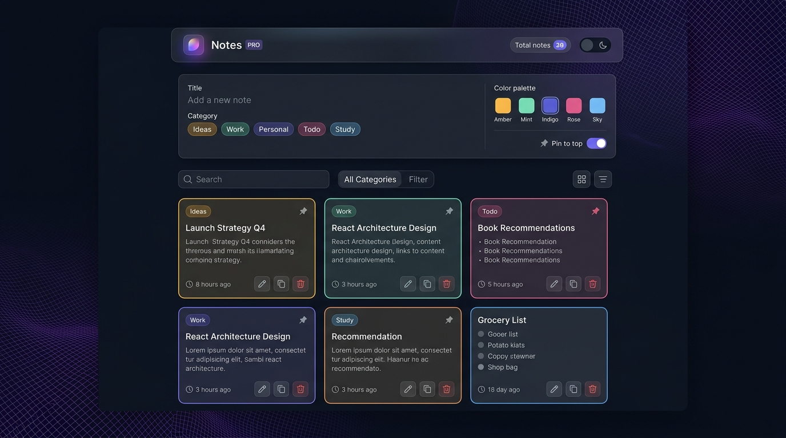
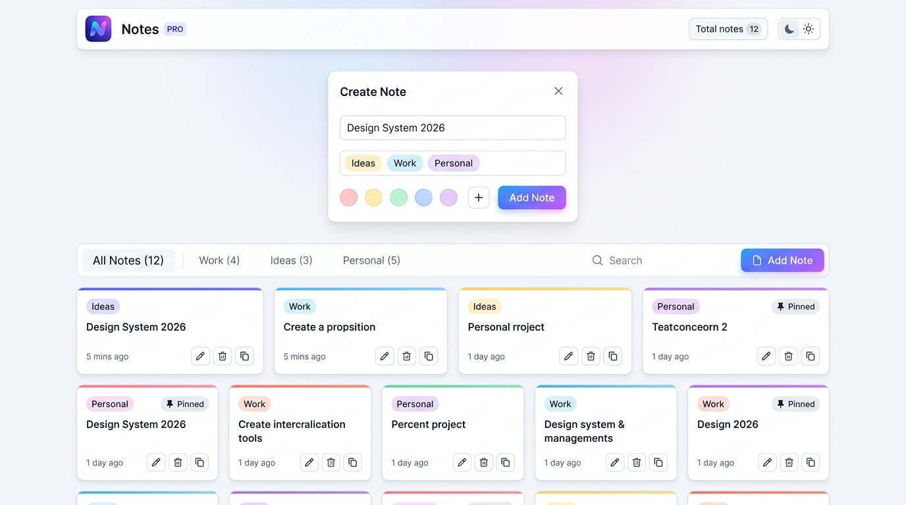

# ✨ Notes App — Modern Full-Stack CRUD Application

A modern, high-performance **Full-Stack Notes Application** built with **React, Node.js, Express, and MongoDB**. Designed with a glassmorphic aesthetic, dark/light theme switching, instant search & categorization, color accents, note pinning, copy-to-clipboard, animated modals, and toast notifications.

---

## 📸 App Previews

<div align="center">

### 🌙 Dark Mode (Glassmorphic Theme)


### ☀️ Light Mode (Modern Clean Theme)


### 📱 Responsive & Cross-Device Experience


</div>

---

## 🌟 Key Features

- 🌓 **Dual Themes (Dark & Light)**: Seamless switching with persistence in `localStorage` and system preference detection.
- ⚡ **Full CRUD Capabilities**: Add, view, edit, and delete notes in real time with instant UI synchronization.
- 📌 **Pin to Top**: Keep priority notes anchored in a dedicated "Pinned Notes" section.
- 🏷️ **Smart Categorization**: Organize notes into Work, Personal, Ideas, Todo, Study, and Quotes with color-coded tags.
- 🎨 **Visual Color Palettes**: Choose from 6 custom color accents (Amber Gold, Emerald Mint, Vibrant Indigo, Rose Pink, Sky Blue, Purple Violet).
- 🔍 **Live Search & Filtering**: Instant search across titles and note contents with filter tabs and reset buttons.
- 🔀 **View Switcher & Sorting**: Toggle between **Grid/Bento** view and **Compact List** view; sort by Newest, Oldest, or Alphabetical (A-Z).
- 📋 **One-Click Copy**: Copy complete note content to clipboard with real-time feedback.
- 🛡️ **Smooth Confirmation Modals**: Elegant dialogs for confirming deletions without crude browser alerts.
- 🔔 **Interactive Toast Feedback**: Floating alerts for note creation, updates, pinning, and deletion.
- 🗄️ **Zero-Config Database**: Connects to MongoDB Atlas or local MongoDB, with an automatic **in-memory database fallback** for zero-setup local development.

---

## 🛠️ Tech Stack

| Layer | Technology | Highlights |
| :--- | :--- | :--- |
| **Frontend** | React 18, Vite 5 | Fast HMR, CSS Design Tokens, Glassmorphism, Custom SVG Icons |
| **Backend** | Node.js, Express.js | RESTful API, CORS, centralized error handling, async wrapper |
| **Database** | MongoDB & Mongoose | Flexible document schema, automated timestamps, in-memory fallback |

---

## 📂 Project Structure

```
notes app/
├── screenshots/             # Application preview screenshots
│   ├── dark-mode-preview.jpg
│   ├── light-mode-preview.jpg
│   └── responsive-preview.jpg
│
├── server/                  # Express.js + MongoDB REST API backend
│   ├── config/
│   │   └── db.js            # MongoDB connection (with in-memory fallback)
│   ├── middleware/
│   │   └── errorHandler.js  # Centralized error handler
│   ├── models/
│   │   └── Note.js          # Mongoose schema (title, content, category, color, pinned, tags)
│   ├── routes/
│   │   └── notes.js         # RESTful CRUD routes (/api/notes)
│   ├── server.js            # Server entry point
│   ├── requests.http        # Ready-to-run HTTP requests for testing
│   ├── .env.example         # Sample environment config
│   └── package.json
│
├── client/                  # React (Vite) frontend application
│   ├── src/
│   │   ├── components/
│   │   │   ├── Icons.jsx        # Lightweight SVG icon collection
│   │   │   ├── NoteForm.jsx     # Modern note creation & edit composer
│   │   │   ├── NoteItem.jsx     # Note card with tags, accent, copy, edit, delete
│   │   │   ├── NoteList.jsx     # Grid/List layout with pinned sections & empty states
│   │   │   ├── Toast.jsx        # Animated floating notification alert
│   │   │   └── ConfirmModal.jsx # Sleek confirmation dialog modal
│   │   ├── api.js           # Centralized API fetch wrapper
│   │   ├── App.jsx          # Top-level state, search, filter, theme management
│   │   ├── App.css          # Glassmorphic component styles & layouts
│   │   ├── index.css        # Design tokens for light/dark modes & global resets
│   │   └── main.jsx         # React application entry point
│   ├── index.html           # HTML template with Google Fonts
│   ├── vite.config.js       # Vite dev server with proxy to backend (:5000)
│   └── package.json
│
└── README.md                # Project documentation
```

---

## 🚀 Getting Started

You'll run **two** terminal processes: the backend server and the frontend client.

### 1. Start the Backend (Terminal 1)

```bash
cd "server"
npm install
npm run dev               # Starts API server on http://localhost:5000
```

> **Note:** If you don't have MongoDB installed locally, the server automatically starts a temporary in-memory MongoDB database so you can start right away without setup!

### 2. Start the Frontend (Terminal 2)

```bash
cd "client"
npm install
npm run dev               # Starts React Vite dev server on http://localhost:5173
```

Open **http://localhost:5173** in your web browser to use the app.

---

## 📡 REST API Reference

Base URL: `http://localhost:5000/api/notes`

| Method | Endpoint | Description | Request Body |
| :--- | :--- | :--- | :--- |
| `GET` | `/api/notes` | List all notes (pinned first, then newest) | — |
| `GET` | `/api/notes/:id` | Retrieve single note by ID | — |
| `POST` | `/api/notes` | Create a new note | `{ "title": "...", "content": "...", "category": "...", "color": "...", "pinned": false }` |
| `PUT` | `/api/notes/:id` | Update an existing note | `{ "title": "...", "content": "...", "category": "...", "color": "...", "pinned": true }` |
| `DELETE` | `/api/notes/:id` | Delete note by ID | — |
| `GET` | `/api/health` | Server health check | — |

### Example Request Body (POST / PUT)

```json
{
  "title": "Launch Strategy Q4",
  "content": "Finalize Q4 roadmap, prepare marketing assets, and deploy to staging.",
  "category": "Work",
  "color": "indigo",
  "pinned": true
}
```

---

## ⚙️ Configuration (`server/.env`)

| Variable | Default | Description |
| :--- | :--- | :--- |
| `PORT` | `5000` | Port for the Express backend |
| `MONGODB_URI` | `mongodb://127.0.0.1:27017/notesapp` | MongoDB connection string (Local or MongoDB Atlas) |
| `USE_MEMORY_DB_FALLBACK` | `true` | Enable automated in-memory MongoDB fallback |
| `CLIENT_ORIGIN` | `http://localhost:5173` | Allowed frontend CORS origin |

---

## 🧪 Build for Production

To create an optimized production build of the React frontend:

```bash
cd client
npm run build
```

The compiled assets will be ready in `client/dist/`.

---

## 📄 License

This project is licensed under the MIT License.
